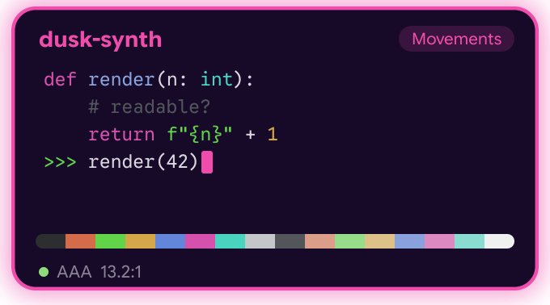

# ghostty-config

A terminal UI to set up [Ghostty](https://ghostty.org): themes, colours, fonts, window and input options. It edits your existing Ghostty config in place and runs in any terminal, as a palette in the bottom rows of the one you are in.


## Install

```bash
go install github.com/vitruves/ghostty-config/cmd/ghostty-config@latest
```

Building needs Go 1.26 (the Go command fetches it by itself if yours is older). The interface is written with [Bubble Tea v2](https://charm.land/bubbletea).

Or from source:

```bash
git clone https://github.com/vitruves/ghostty-config.git
cd ghostty-config
make build && make local-install
```

## Usage

Run `ghostty-config`. A card opens in the bottom rows of your terminal: a prompt, six tabs (Themes, Fonts, Window, Input, Session, Tool), a list, and under it an explanation of the highlighted line. Pick a tab with the arrows or the mouse, or type a command's name.

| Key | Action |
| --- | --- |
| `↑` `↓` | Move in the list |
| `Tab` | Next tab, or complete the value being typed |
| `Enter` | Open a command, or apply the highlighted value |
| `Ctrl+X` | Delete the highlighted theme file, after asking |
| `Esc` | Go back, then leave |
| `F2` | Hide the palette to see the terminal behind it |
| `F1` | Help |
| `Ctrl+C` | Leave without writing anything |

Browsing never changes your config or your terminal. A theme is written only when you press `Enter` on it, and then the terminal takes its colours at once; a setting is written when you choose its value.

## Pictures

In Ghostty and Kitty the highlighted theme is shown as a picture beside its details, drawn through the Kitty graphics protocol: a card with rounded corners and a soft shadow, a few lines of sample output in its own colours, its sixteen colours as one strip, and how readable it is. The text in the picture is set in Google Sans Code and Google Sans Flex, built into the program (SIL Open Font License, see `internal/kimg/fonts`), so it looks the same whatever font your terminal uses.



Elsewhere the details are drawn from cells as before. `-no-images` forces that, `-images` asks for the picture in a terminal that is not known to draw it, and nothing is drawn as a picture inside tmux or screen. To have the rest of the interface in the same typeface, `Download` offers Google Sans Code first and `Font` picks it.

## Themes

The `Collection` command installs 252 curated themes in 27 families. Each takes its structure from a named account of colour, so a theme's name tells you the logic behind it: moods (Focus, Calm, Warmth, Energy), historical colour theory (Goethe, Itten, Hering, Kobayashi, Birren, Luscher, Munsell), vision and sleep science (Scotopic, Circadian), and, new in this release, Plutchik's emotion wheel, the harmony rules taught in design schools (analogous, triadic, split-complement, 60-30-10…), Gestalt laws, Albers, Dutch and Swiss modernism, Japanese aesthetics, cognitive psychology (Stroop, Yerkes-Dodson, flow, Von Restorff), Jung's archetypes, Kandinsky and the art movements. Colour–mood links are mostly convention and several of these theories are historical rather than correct; what is checked is legibility: every theme clears WCAG AAA for body text and AA for every ANSI colour, and the test suite enforces it.

| Command | |
| --- | --- |
| `Theme` | Browse, with the highlighted theme shown beside its details; moving only looks, `Enter` applies. Typing a family name such as `Gestalt` lists that family |
| `Favs` `Fav` | Starred themes |
| `New` `Random` | Generate a theme from a harmony rule |
| `Edit` | Change a colour: brightness, hue, saturation, lightness, or a hex |
| `Save` `Fork` `Undo` | Manage your own themes |
| `Delete` | Pick a theme file to delete from your themes directory, or `collection` to remove every installed collection theme; in any theme list `Ctrl+X` deletes the highlighted one. Always asks first; bundled themes are never touched |

## Fonts

| Command | |
| --- | --- |
| `Font` `Style` `Size` | Family, style and size |
| `Download` | Install a Nerd Font |
| `Lineheight` `Cellwidth` `Ligatures` | Line spacing, letter spacing, ligatures |
| `Thicken` `Thickness` `Faint` | Stroke weight (macOS), strength of it, how dim `dim` text is drawn |

## Window


| Command | |
| --- | --- |
| `Preset` | Nine bundles in one go: `default` `glass` `minimal` `focus` `compact` `reading` `presentation` `power` `careful`. The panel lists each setting that would change, with what it does |
| `Titlebar` `Shadow` | Title bar style and window shadow |
| `Opacity` `Blur` | Transparency |
| `Paddingx` `Paddingy` `Balance` `Paddingcolor` | Padding |
| `Windowtheme` `Colorspace` `Contrast` | Window chrome, colour space, minimum contrast |
| `Splitopacity` `Opaquecells` | Fade unfocused splits, translucent coloured cells |

## Input

| Command | |
| --- | --- |
| `Cursor` `Blink` `Cursoropacity` | Cursor shape, blinking, opacity |
| `Copy` `Clearselect` `Trimspaces` `Pasteguard` | Copy on select, selection and clipboard hygiene, paste protection |
| `Clicktomove` `Hidemouse` `Focusmouse` | Mouse behaviour |
| `Optionalt` | Option as Alt (macOS) |
| `Scrollbar` | Scrollbar visibility |

## Session

| Command | |
| --- | --- |
| `Scrollback` | Scrollback size |
| `Confirmclose` `Quitlast` | Closing behaviour |
| `Notify` | Notification when a long command ends (Ghostty 1.3) |
| `Inheritcwd` `Resizeoverlay` | New windows start where you are; resize popup |
| `Savestate` `Stepresize` | Restore windows, resize in whole cells (macOS) |
| `Tabbar` | Tab bar visibility (Linux) |

## Tool

| Command | |
| --- | --- |
| `Reload` `Autoreload` | Reload Ghostty |
| `Interface` | Colours of the tool itself: `midnight` (near-black, the default, the same in every terminal whatever its theme), `graphite`, `paper`, `theme` to follow the theme being browsed, or `clear` to take the terminal's own background |
| `Overrides` | Disable config lines that override the theme |
| `Collection` | Install the 252 extra themes |
| `Backup` `Paths` | Back up the config, show file locations |

## Options

```
-config file            edit this file instead of the default config
-themes dir             user themes directory
-export-collection dir  write the 252 extra themes to a directory and exit
-no-reload              never ask Ghostty to reload
-no-images              never show the highlighted theme as a picture
-images                 show it as a picture even where the terminal is not known to draw it
-plain                  use only glyphs that every terminal can draw
-paths                  print the files that are read and written
-no-update-check        never look for a newer release on GitHub
-version                print the version
```

## Config files

The tool reads the same files as Ghostty, in the same order: `config` and `config.ghostty` in `~/.config/ghostty/`, then on macOS the same names in `~/Library/Application Support/com.mitchellh.ghostty/`, then any file included with `config-file`. A setting is rewritten on the line where it is currently defined. Comments and other lines are left untouched.

Each file is backed up to `~/.config/ghostty-config/backups/` before its first change. Themes you save go to `~/.config/ghostty/themes/`.

At most once a day, the tool asks GitHub in the background whether a newer release exists and tells you on exit. It never delays startup, stays silent offline, and downloads nothing. Use `-no-update-check` to turn it off.

Ghostty has no reload command. On macOS the tool sends the reload shortcut to Ghostty, which requires the Accessibility permission. Elsewhere, reload Ghostty yourself after a change.

## Credits

Thanks to Mitchell Hashimoto and the contributors of [Ghostty](https://github.com/ghostty-org/ghostty) for the terminal.

## License

MIT
