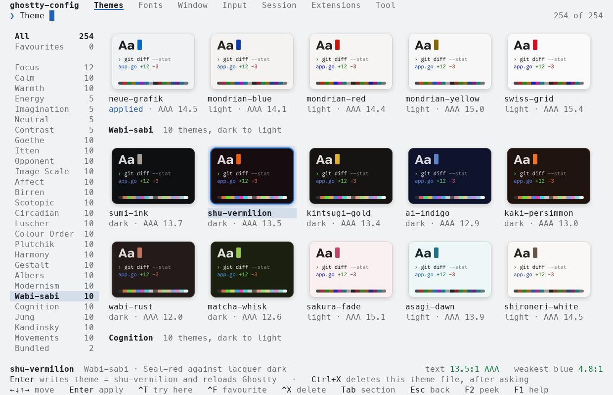

# ghostty-config

A full-screen terminal UI to set up [Ghostty](https://ghostty.org): themes, fonts, window, input and session options, shaders. It edits your existing config in place and takes the colours of the terminal it runs in, light or dark.

<p align="center">
  
</p>

## Install

### Homebrew (macOS)

```bash
brew tap vitruves/ghostty-config https://github.com/Vitruves/ghostty-config
brew install vitruves/ghostty-config/ghostty-config
```

Homebrew installs the tagged release and handles the Go build dependency for you.
Ghostty itself must be installed separately. Run `ghostty-config` in Ghostty after
installation.

To build the latest development version instead:

```bash
brew install --HEAD vitruves/ghostty-config/ghostty-config
```

Upgrade or uninstall with:

```bash
brew upgrade vitruves/ghostty-config/ghostty-config
brew uninstall vitruves/ghostty-config/ghostty-config
```

Uninstalling removes the tool; your Ghostty configuration, themes and backups
remain in your home directory.

### Go or source

```bash
go install github.com/vitruves/ghostty-config/cmd/ghostty-config@latest
```

Or from source, with Go 1.26:

```bash
git clone https://github.com/vitruves/ghostty-config.git
cd ghostty-config
make build && make local-install
```

## Usage

Run `ghostty-config`. Pick a section with `Tab`, move with the arrows, type to search or to run a command, apply with `Enter`. Browsing never changes your config: a theme is written when you press `Enter` on it, a setting when you choose its value.

| Key | Action |
| --- | --- |
| `Tab` | Next section |
| `←` `↓` `↑` `→` | Walk the wall of themes or a list; on a setting, `←` `→` change its value |
| `Enter` | Apply the highlighted theme or value, or open a command |
| `Ctrl+T` | Try the highlighted theme in this terminal, writing nothing |
| `Ctrl+F` `Ctrl+X` | Star a theme; delete a theme file, after asking |
| `F2` `F1` | Step aside to see the terminal; help |
| `Esc` `Ctrl+C` | Go back, then leave; leave without writing anything |

<p align="center">
  
  
  
</p>
<p align="center"><sub>A light terminal · Fonts · Window settings</sub></p>

## Sections

| Section | What it holds |
| --- | --- |
| Themes | Every theme as a card, grouped by family and running from dark to light. 252 curated themes in 27 families, all checked for contrast. Create, edit, save and delete your own |
| Fonts | Family, style, size, spacing, ligatures. Families that are not installed yet are listed under the others: `Enter` downloads one from Nerd Fonts |
| Window | Presets, title bar, opacity, blur, padding, beside a picture of the window as the settings draw it |
| Input | Cursor, clipboard, mouse, Option as Alt |
| Session | Scrollback, closing, notifications, restoring windows |
| Extensions | Shaders and packs of themes (Catppuccin, Rosé Pine), downloaded for you. Source and licence are shown before anything is installed |
| Tool | Reload, the interface's own colours, config lines that override the theme, backup, paths |

## Good to know

- **Light or dark.** The interface asks the terminal for its colours and follows it when they change. `Interface`, in Tool, offers fixed schemes instead.
- **Pictures.** In Ghostty and Kitty the cards are images, drawn through the Kitty graphics protocol. Elsewhere, and inside tmux or screen, they are drawn from cells. `-no-images` and `-images` force one or the other.
- **Shaders.** One at a time. Where the tool can reload Ghostty, it asks whether to keep a shader it has just switched on and puts the config back after ten seconds without an answer, since a shader that fails can leave the window unreadable.
- **Your files.** The tool reads the files Ghostty reads and rewrites a setting on the line where it is defined; comments and other lines are left alone. Each file is backed up to `~/.config/ghostty-config/backups/` before its first change.
- **Network.** Used only for the downloads you ask for and, at most once a day, to check for a newer release. `-no-update-check` turns that off.
- **Reload.** Ghostty has no reload command. On macOS the tool sends it the reload shortcut, which needs the Accessibility permission; elsewhere, reload Ghostty yourself.

## Options

```
-config file            edit this file instead of the default config
-themes dir             user themes directory
-export-collection dir  write the 252 curated themes to a directory and exit
-no-reload              never ask Ghostty to reload
-no-images              never draw pictures: the wall of themes is made of cells
-images                 draw pictures even where the terminal is not known to show them
-plain                  use only glyphs that every terminal can draw
-paths                  print the files that are read and written
-no-update-check        never look for a newer release on GitHub
-version                print the version
```

## Credits

Thanks to Mitchell Hashimoto and the contributors of [Ghostty](https://github.com/ghostty-org/ghostty) for the terminal. Shaders come from [KroneCorylus/ghostty-shader-playground](https://github.com/KroneCorylus/ghostty-shader-playground) and [0xhckr/ghostty-shaders](https://github.com/0xhckr/ghostty-shaders).

## License

MIT
