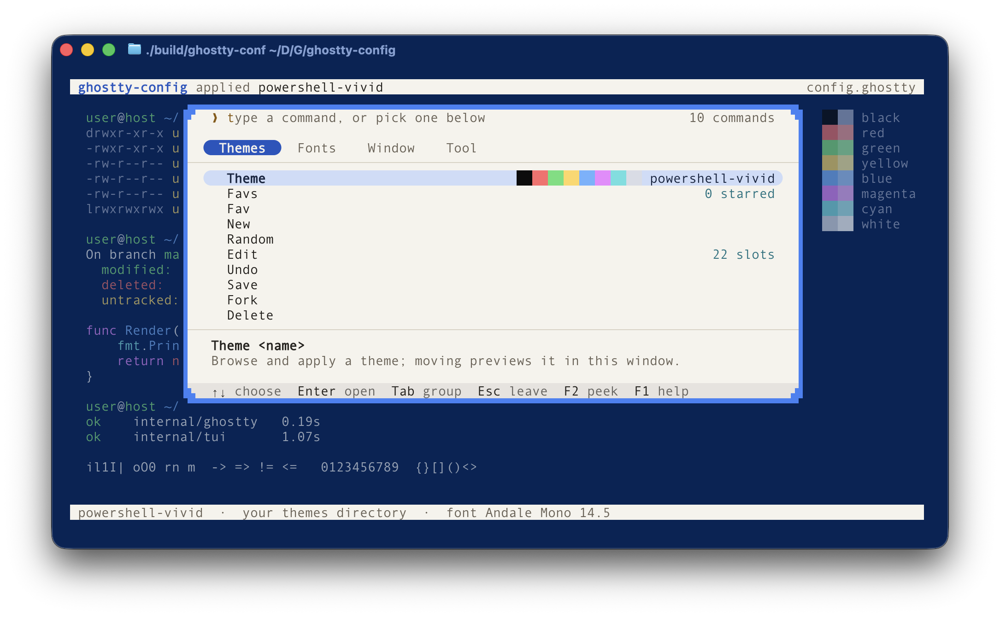
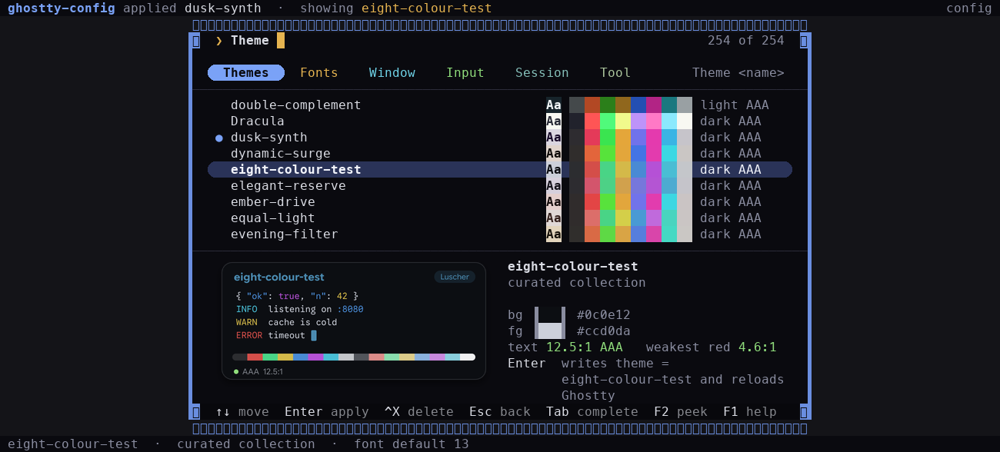
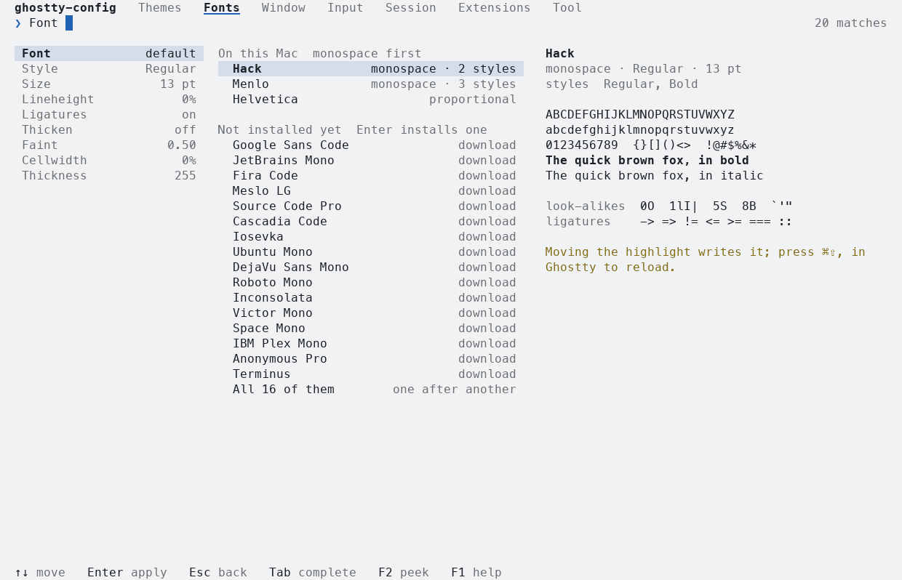
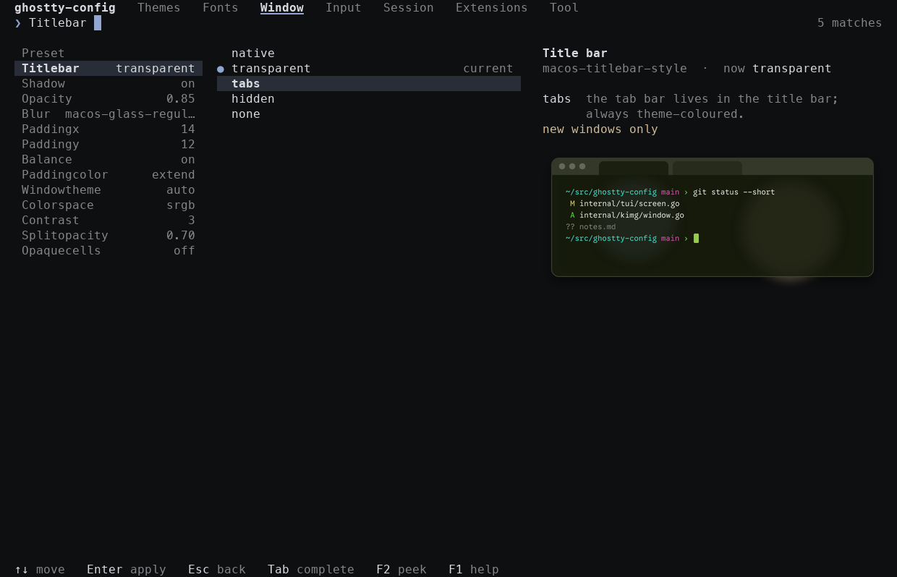
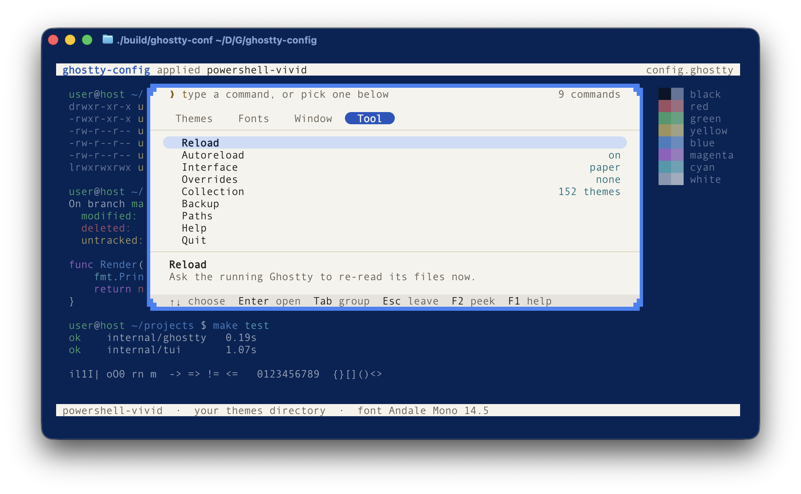

# ghostty-config

A terminal UI to set up [Ghostty](https://ghostty.org): themes, colours, fonts and window options. It edits your existing Ghostty config in place and runs in any terminal.



## Install

```bash
go install github.com/vitruves/ghostty-config/cmd/ghostty-config@latest
```

Or from source:

```bash
git clone https://github.com/vitruves/ghostty-config.git
cd ghostty-config
make build && make local-install
```

## Usage

Run `ghostty-config`. Commands are grouped in four tabs. Pick one with the arrows or the mouse, or type its name.

| Key | Action |
| --- | --- |
| `↑` `↓` | Move in the list |
| `Tab` | Next tab, or complete the value being typed |
| `Enter` | Open a command, or apply the highlighted value |
| `Esc` | Go back, then leave |
| `F2` | Hide the palette to see the terminal behind it |
| `F1` | Help |
| `Ctrl+C` | Leave without writing anything |

Browsing never changes your config. A value is written only when you press `Enter` on it.

## Themes



| Command | |
| --- | --- |
| `Theme` | Browse and apply, with live preview |
| `Favs` `Fav` | Starred themes |
| `New` `Random` | Generate a theme |
| `Edit` | Change a colour |
| `Save` `Fork` `Undo` `Delete` | Manage your own themes |

## Fonts



| Command | |
| --- | --- |
| `Font` `Style` `Size` | Family, style and size |
| `Download` | Install a Nerd Font |
| `Lineheight` `Ligatures` `Thicken` | Line spacing, ligatures, stroke weight |

## Window



| Command | |
| --- | --- |
| `Titlebar` `Shadow` | Title bar style and window shadow |
| `Opacity` `Blur` | Transparency |
| `Paddingx` `Paddingy` `Balance` `Paddingcolor` | Padding |
| `Windowtheme` `Colorspace` `Contrast` | Window chrome, colour space, minimum contrast |
| `Cursor` `Blink` | Cursor |

## Tool



| Command | |
| --- | --- |
| `Reload` `Autoreload` | Reload Ghostty |
| `Interface` | Colours of the tool itself |
| `Overrides` | Disable config lines that override the theme |
| `Collection` | Install the 152 extra themes |
| `Backup` `Paths` | Back up the config, show file locations |

## Options

```
-config file            edit this file instead of the default config
-themes dir             user themes directory
-export-collection dir  write the 152 extra themes to a directory and exit
-no-reload              never ask Ghostty to reload
-plain                  use only glyphs that every terminal can draw
-paths                  print the files that are read and written
-no-update-check        never look for a newer release on GitHub
-version                print the version
```

## Config files

The tool reads the same files as Ghostty, in the same order: `config` and `config.ghostty` in `~/.config/ghostty/`, then on macOS the same names in `~/Library/Application Support/com.mitchellh.ghostty/`, then any file included with `config-file`. A setting is rewritten on the line where it is currently defined. Comments and other lines are left untouched.

Each file is backed up to `~/.config/ghostty-config/backups/` before its first change. Themes you save go to `~/.config/ghostty/themes/`.

At most once a day, the tool asks GitHub in the background whether a newer release exists and tells you on exit. It never delays startup, stays silent offline, and downloads nothing. Use `-no-update-check` to turn it off.

Ghostty has no reload command. On macOS the tool sends the reload shortcut to Ghostty, which requires the Accessibility permission. Elsewhere, reload Ghostty yourself after a change.

## Credits

Thanks to Mitchell Hashimoto and the contributors of [Ghostty](https://github.com/ghostty-org/ghostty) for the terminal.

## License

MIT
